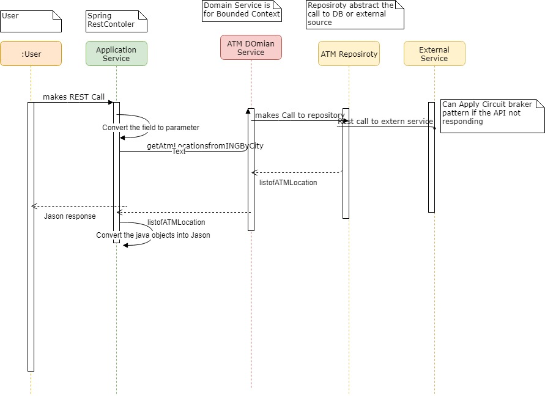

# Atm Finder

A spring boot project with basic spring security in place. The rest API is exposed by cosuming a  External rest-api. 
The API is consumed by UI built on basic Jquery 

## Different REST End point Exposed in Application

*  list all the ATM without any Filter

`http://localhost:8080/ATMlocations/`

Sample PayLoad will be 

```
{
"list": [
{
"address": {
"street": "Osdorpplein",
"housenumber": "469",
"postalcode": "1068 SZ",
"city": "Amsterdam",
"geoLocation": {
"lat": "52.358823",
"lng": "4.802086"
}
},
"distance": 0,
"type": "ING"
}

```

*  Search ATMS for a given city

Example

```
http://localhost:8080/ATMlocations/search?city=Amsterdam
```
Sample payload will be 

```
{
"list": [
{
"address": {
"street": "Buikslotermeerplein",
"housenumber": "426",
"postalcode": "1025 WP",
"city": "Amsterdam",
"geoLocation": {
"lat": "52.397468",
"lng": "4.94107"
}
},
"distance": 0,
"type": "ING"
}

```
## Overall Architecture 


Utilized spring initializer project to generate the Skeleton

- Added thymeleaf templating engine, with basic spring security starter and spring boot jersey dependencies.
- Configured Basic Security, Resttemplate calls with by-passing ssl for consuming ING web service ( https://www.ing.nl/api/locator/atms/ )
- jQuery and Datatables.js is utilized along with Bootstrap.css for implementing UI elements.

## How is the Architecture Designed  and components are layered ?


I have MVC Pattern with Domian Driven Design Concept

### Application Service :
Spring Rest Controler acts a Application Service (AtmApplicationService.java)
This  exposes 2 rest api's as explained Above

This will be calling multiple Domain Services depending on the Use case . In our case we have a simple get we call and no orchestarion involved.

#### Domain Services :
AtmDomainServiceImpl : implements business logic behind the exposed web services utilizing output from repository.
This services is only responsible ATM Aggreagte .

#### Repositories :
AtmDataReposiroty : This utilizes spring rest-template for consuming the ING ATM locator service. This will abstact the external API call from the domain service . 
#### Other Design Principels Used 
Program for Interface : All the layers depending on the interface and dependcies are injected using the Spring Dependecy Injection

#### Areas of Improved if i had time 
Resilency and Exception Handling 

* Circuit braker while callign external service this will take care of time out issues and external service not responding 
* Added pagination for Search REST end point so that we can fetch all the ATM Location at one go . This will avoid any huge payload being sent over the network 
* Added proper code for Error handling and do some validation for input parameter
* Implemeted Swagger for API documentation 
 


#### User interface :

- /home OR / : Home page.
- /login     : Login page. uses in-memory auth : Credentials as:
-                 username : user , password : password
- /atm       : Page that lists all the atm addresses exposed by ING service in form of a Datatable which has all the functions available for sorting , Live search and pagination.

Tools used :
- Maven
- JDK 7
- Spring boot
- Tomcat 7


How to Run ?
maven should be installed.

- clone the repo.
- mvn clean install 
- Deploy to Tomcat 7

OR
- clone the repo.
- mvn clean spring-boot:run
